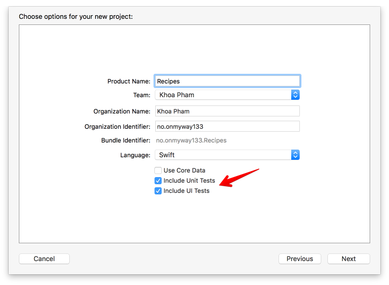
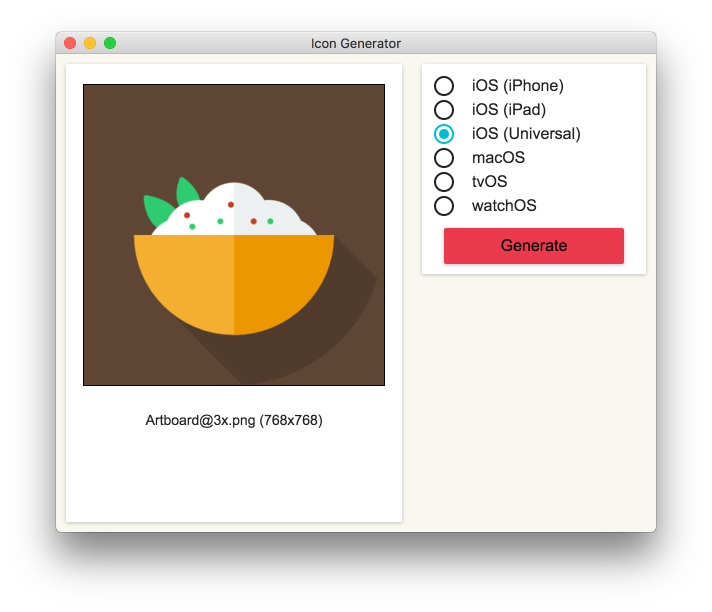

Recipes App
==

## Description

- An app that showcases many recipes together with their detail information
- Support iOS 9+
- Use Xcode 9.3, Swift 4.0
- Use data from http://food2fork.com/about/api
- Good practices for structuring iOS app and handle dependencies
- I'm a fan of exploring [architectures](https://github.com/onmyway133/fantastic-ios-architecture) and how to structure code in a better way. I've tried many things. In this project I use old good MVC.
- Ideas are from my experience and learnings from community. Pull requests are more than welcome ❤️

### Project

- Create new project, select both Unit Tests and UI Tests as we should write tests early.
- Organising files

  - Source: contains source code files, splitted into features
  - Resource: contains plist, resource, Storyboard files

### Code convention

- I agree with most of the style guides in https://github.com/raywenderlich/swift-style-guide and https://github.com/github/swift-style-guide
- Use consistent and easy-to-reason indentation [Indenting Swift code](https://github.com/onmyway133/blog/issues/93)
- Prefer camelCase [Using camelCase for abbreviations](https://github.com/onmyway133/blog/issues/147)

### Git

- Use `.gitignore` file from https://www.gitignore.io/api/swift
- There are both pros and cons in [checking in dependencies](https://guides.cocoapods.org/using/using-cocoapods#should-i-check-the-pods-directory-into-source-control) files (CocoaPods and Carthage). Here I choose to ignore them to not clutter the code base.

> Whether or not you check in the Pods directory, the Podfile and Podfile.lock should always be kept under version control.

### Launch Screen

- Prefer using `LaunchScreen.storyboard`
- Add launch image to `Asset Catalog`, open `LaunchScreen.storyboard`, add `UIImageView` and pin it to the egdes of `UIView`
- Should not pin to Safe Area as we want image to be full screen. Also unselect any margins in Auto Layout constraints
- Set `UIImageView` 's `contentMode` as `Aspect Fill`

### App Icon

- Make sure image has no transparent pixels, otherwise it results in black background. Read [
Human Interface Guidelines - App Icon](https://developer.apple.com/ios/human-interface-guidelines/icons-and-images/app-icon/)

> Keep the background simple and avoid transparency. Make sure your icon is opaque, and don’t clutter the background. Give it a simple background so it doesn’t overpower other app icons nearby. You don’t need to fill the entire icon with content.

- Preferrably use image with size greater than 1024x1024
- Use [IconGenerator](https://github.com/onmyway133/IconGenerator) to generate `AppIcon.appiconset`

### API

- Register for account in http://food2fork.com/about/api
- I use [1Password](https://1password.com/) to generate and store my passwords.
- I use [Insomnia](https://github.com/getinsomnia/insomnia) to test and analyze API response.

### SwiftLint

- Regardless of what platform we develop, it's good to have a linter to enfore consistent conventions
- I use [SwiftLint](https://github.com/realm/SwiftLint)
- Add `pod 'SwiftLint', '~> 0.25'` to `Podfile`. It's also a good practice to specify [version](https://guides.cocoapods.org/syntax/podfile.html#pod) of the dependencies
- Add `.swiftlint.yml`. A sample can be found [here](https://github.com/realm/SwiftLint/blob/master/.swiftlint.yml)
- Add new Run Script Phrase to execute `swiftlint` after compiling

## Credit

- Launch image is from http://desertrosemediapa.com/
- App icon is from https://www.flaticon.com/free-icon/rice_168559

## Licence

This project is released under the MIT license. See LICENSE.md.
