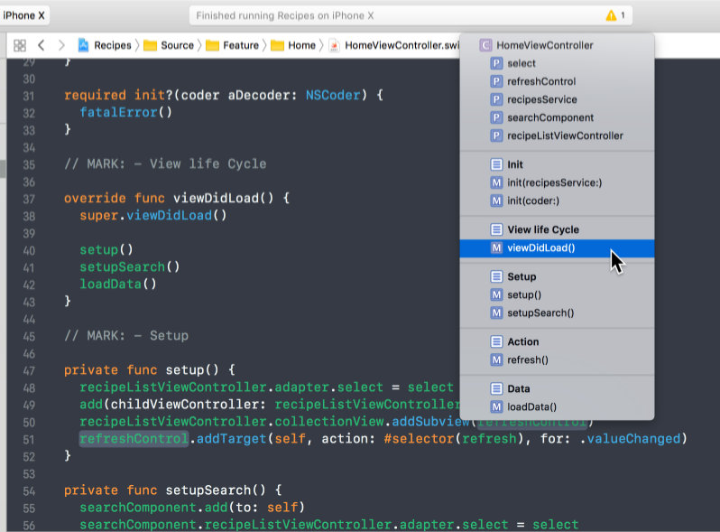
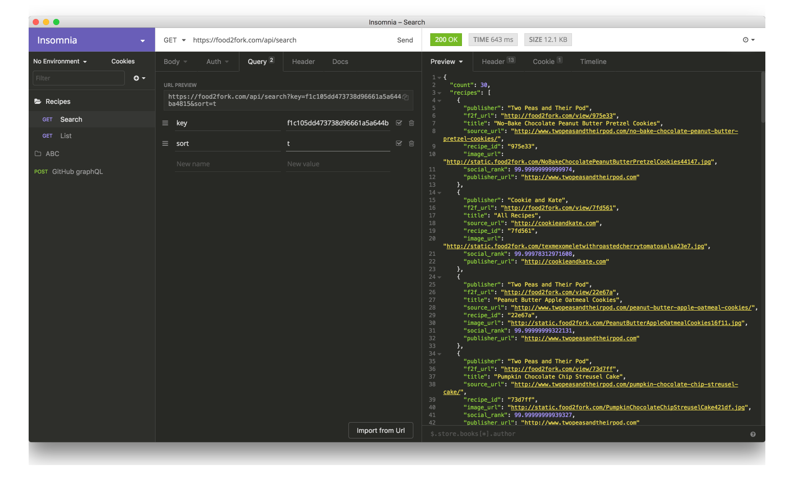
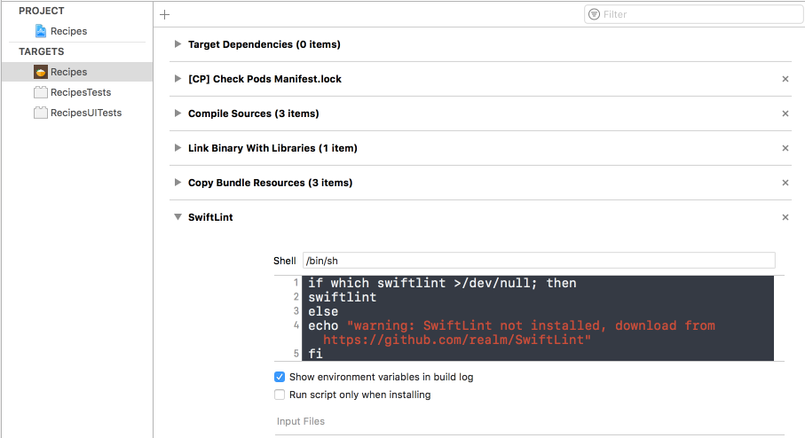
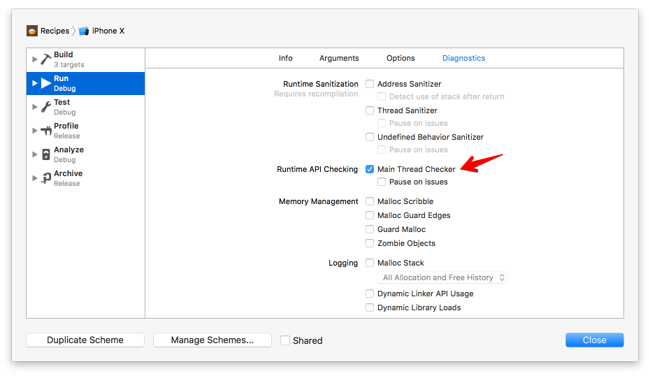
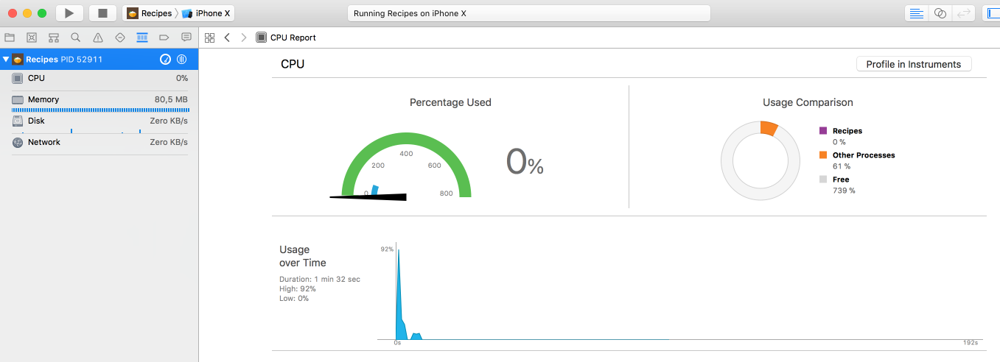

Recipes App
==

## Description

- An app that showcases many recipes together with their detail information
- Contain lots of good practices for structuring iOS app and handle dependencies
- Support iOS 9+
- Use Xcode 9.3, Swift 4.0
- Ideas are from my experience and learnings from colleagues, community. Pull requests are more than welcome ❤️

<div align="center">


</div>

### Minimum supported iOS version

- As of early 2018, the latest version is iOS 11
- See measurements about iOS adoption on [AppStore](https://developer.apple.com/support/app-store/)
- Apple suggests supporting 2 latest versions
- Supporting iOS 9 is not a pain for this app, it's good to have since there's quite a few percentage of users according to the chart below.
- Ideally, to determine when to drop support old iOS versions, we need analytics about how users use our app.

<div align="center">

</div>


### Project

- Create new project, select both Unit Tests and UI Tests as we should write tests early.
- We can organise files by feature/module or role/types. Each has its pros and cons
- By role/type:
  - Pros: 
    - Less thinking about where to put files.
    - Easier to apply scripts or filter
  - Cons:
    - Hard to correlate if we want to find files related to same feature
    - Take time to reorganise files if we want to make them into reusable components
- By feature/module
  - Pros:
    - Make things modular
    - Encourage composition
  - Cons:
    - May be messy when many files of different types stay close

### Modular

- It may depend on projects, but I usually group things by feature/module. It answers the question "What does this app do?" instead of "What is this file?".

  - Source: contains source code files, splitted into features
    - Features: contain main features in the app
      - Home: the home screen, showing a list of recipes and open search
      - List: show a list of recipes, know how to reload and show empty view
      - Search: handle search and debouncing
      - Detail: show detail information
    - Library
      - Flow: contains FlowController to manage flows
      - Adapater: Generic data source for `UICollectionView`
      - Extension: convenient extensions for common operations
      - Model: The model in the app, parsed from json
  - Resource: contains plist, resource, Storyboard files


### Code convention

- I agree with most of the style guides in https://github.com/raywenderlich/swift-style-guide and https://github.com/github/swift-style-guide
- Use consistent and easy-to-reason indentation [Indenting Swift code](https://github.com/onmyway133/blog/issues/93)
- Prefer camelCase [Using camelCase for abbreviations](https://github.com/onmyway133/blog/issues/147)

### Documentation

- Good code explains itself.
- I find it useful to add documentations to classes and methods to briefly explain what they do
- Press `Cmd+Alt+/` to generate documentation with `///`

### MARK

- Using of `MARK` can be helpful to separate sections of code. It also groups functions nicely in Navigation Bar



- You can also use `extension` groups related properties, methods
- For `UIViewController` we possibly have

```
// MARK: - Init
// MARK: - View life cycle
// MARK: - Setup
// MARK: - Action
// MARK: - Data
```

### Git

- Use `.gitignore` file from https://www.gitignore.io/api/swift
- There are both pros and cons in [checking in dependencies](https://guides.cocoapods.org/using/using-cocoapods#should-i-check-the-pods-directory-into-source-control) files (CocoaPods and Carthage). Here I choose to ignore them to not clutter the code base.

> Whether or not you check in the Pods directory, the Podfile and Podfile.lock should always be kept under version control.

### Dependencies

- I make and contribute to [Open Source](https://github.com/onmyway133/blog/issues/5) a lot.
- Using [framework](https://github.com/onmyway133/blog/issues/105) give you a [boost](https://github.com/onmyway133/blog/issues/85) at the start, but it also restricts you a lot in the future.
- In this app, I try to use as few dependencies as possible

### Launch Screen

- Prefer using `LaunchScreen.storyboard`
- Add launch image to `Asset Catalog`, open `LaunchScreen.storyboard`, add `UIImageView` and pin it to the egdes of `UIView`
- Should not pin to Safe Area as we want image to be full screen. Also unselect any margins in Auto Layout constraints
- Set `UIImageView` 's `contentMode` as `Aspect Fill`


### App Icon

- Make sure image has no transparent pixels, otherwise it results in black background. Read [
Human Interface Guidelines - App Icon](https://developer.apple.com/ios/human-interface-guidelines/icons-and-images/app-icon/)

> Keep the background simple and avoid transparency. Make sure your icon is opaque, and don’t clutter the background. Give it a simple background so it doesn’t overpower other app icons nearby. You don’t need to fill the entire icon with content.

- Preferrably use image with size greater than 1024x1024
- Use [IconGenerator](https://github.com/onmyway133/IconGenerator) to generate `AppIcon.appiconset`


### API

- Register for account in http://food2fork.com/about/api
- I use [1Password](https://1password.com/) to generate and store my passwords.
- I use [Insomnia](https://github.com/getinsomnia/insomnia) to test and analyze API response.



### SwiftLint

- Regardless of what platform we develop, it's good to have a linter to enfore consistent conventions
- I use [SwiftLint](https://github.com/realm/SwiftLint)
- Add `pod 'SwiftLint', '~> 0.25'` to `Podfile`. It's also a good practice to specify [version](https://guides.cocoapods.org/syntax/podfile.html#pod) of the dependencies
- Add `.swiftlint.yml`. A sample can be found [here](https://github.com/realm/SwiftLint/blob/master/.swiftlint.yml)
- Add new Run Script Phrase to execute `swiftlint` after compiling



### Model

- It may sound boring but clients are just a prettier way to represent the API response. The model is perhaps the most basic thing and we use it a lot in the app. It plays such an important role and there can be some obvious bugs related to malformed models and assumption about how a model should be parsed.
- We should have test for every model of the app. Ideally we need automate testing of models from API response in case the model is changed from the backend.
- From Swift 4, we can conform our model to [Codable](https://developer.apple.com/documentation/swift/codable) to easily serialise to and from json.
- Model should be immutable

```swift
struct Recipe: Codable {
  let publisher: String
  let url: URL
  let sourceUrl: String
  let id: String
  let title: String
  let imageUrl: String
  let socialRank: Double
  let publisherUrl: URL

  enum CodingKeys: String, CodingKey {
    case publisher
    case url = "f2f_url"
    case sourceUrl = "source_url"
    case id = "recipe_id"
    case title
    case imageUrl = "image_url"
    case socialRank = "social_rank"
    case publisherUrl = "publisher_url"
  }
}
```

- We can use some test frameworks if you like fancy syntax or Rspec style. Some 3rd party test frameworks may have issues. I find `XCTest` good enough.

```swift
import XCTest
@testable import Recipes

class RecipesTests: XCTestCase {
  func testParsing() throws {
    let json: [String: Any] = [
      "publisher": "Two Peas and Their Pod",
      "f2f_url": "http://food2fork.com/view/975e33",
      "title": "No-Bake Chocolate Peanut Butter Pretzel Cookies",
      "source_url": "http://www.twopeasandtheirpod.com/no-bake-chocolate-peanut-butter-pretzel-cookies/",
      "recipe_id": "975e33",
      "image_url": "http://static.food2fork.com/NoBakeChocolatePeanutButterPretzelCookies44147.jpg",
      "social_rank": 99.99999999999974,
      "publisher_url": "http://www.twopeasandtheirpod.com"
    ]

    let data = try JSONSerialization.data(withJSONObject: json, options: [])
    let decoder = JSONDecoder()
    let recipe = try decoder.decode(Recipe.self, from: data)

    XCTAssertEqual(recipe.title, "No-Bake Chocolate Peanut Butter Pretzel Cookies")
    XCTAssertEqual(recipe.id, "975e33")
    XCTAssertEqual(recipe.url, URL(string: "http://food2fork.com/view/975e33")!)
  }
}

```

### FlowController

- FlowController is used to manage many `UIViewController` related to a common feature.
- Read [FlowController and Coordinator](https://github.com/onmyway133/blog/issues/106)
- There are `AppFlowController` that manages changing `rootViewController`. For now it start `RecipeFlowController`

```swift
window = UIWindow(frame: UIScreen.main.bounds)
window?.rootViewController = appFlowController
window?.makeKeyAndVisible()
appFlowController.start()
```

- `RecipeFlowController` manages, in fact it is, `UINavigationController`, that handles pushing `HomeViewController, RecipesDetailViewController, SafariViewController`

```swift
final class RecipeFlowController: UINavigationController {
  /// Start the flow
  func start() {
    let service = RecipesService(networking: NetworkService())
    let controller = HomeViewController(recipesService: service)
    viewControllers = [controller]
    controller.select = { [weak self] recipe in
      self?.startDetail(recipe: recipe)
    }
  }

  private func startDetail(recipe: Recipe) {}
  private func startWeb(url: URL) {}
}
```

- The `UIViewController` can use `delegate` or `closure` to notify `FlowController` about changes or next screen in the flow. For `delegate` there may need for check when there are 2 instances of the same classes. Here we use `closure` for simplicity.

### Auto Layout

- I try to use Auto Layout as much as possible to make adaptive UI.
- We can use libraries like [Anchors](https://github.com/onmyway133/Anchors) to do declarative and fast Auto Layout.
- However in this app, we can just use `NSLayoutAnchor` since it is from iOS 9.
- Inspired by [Constraint](https://github.com/hyperoslo/Sugar/blob/master/Sources/iOS/Constraint.swift)

```swift
extension NSLayoutConstraint {
  static func activate(_ constraints: [NSLayoutConstraint]) {
    constraints.forEach {
      ($0.firstItem as? UIView)?.translatesAutoresizingMaskIntoConstraints = false
      $0.isActive = true
    }
  }
}
```

### Architecture

- I'm a fan of exploring [architectures](https://github.com/onmyway133/fantastic-ios-architecture)
- All architectures, patterns define roles for each objects, and how to connect them.
- Remember these principles
  - Encapsuate what varies
  - Favor composition over inheritance
  - Program to interface, not to implementation

### Massive View Controller

- There is no massive view controller, it's just us writing bad code. However there are ways to [slim](http://khanlou.com/2014/09/8-patterns-to-help-you-destroy-massive-view-controller/) it down.
- In this app. I use
  - Service: injected into view controller to perform a single task
  - Generic View: move view and controls declaration to View layer
  - Child view controller: Compose child view controllers to build more features

### Access Control

- From [Access Control](https://developer.apple.com/library/content/documentation/Swift/Conceptual/Swift_Programming_Language/AccessControl.html)

> Access control restricts access to parts of your code from code in other source files and modules. This feature enables you to hide the implementation details of your code, and to specify a preferred interface through which that code can be accessed and used.

- Everything should be `private` and `final` by default. This also helps the [compiler](https://developer.apple.com/swift/blog/?id=27).
- When seeing a public property, we need to search for it across project before doing further with it. If the property is used only within a `class`, making it `private` means we don't need to care if it breaks elsewhere.
- Declare as many `final` as possible

```swift
final class HomeViewController: UIViewController {}
```

- Declare properties as `private` or at least `private(set)`

```swift
final class RecipeDetailView: UIView {
  private let scrollableView = ScrollableView()
  private(set) lazy var imageView: UIImageView = self.makeImageView()
}
```

### Lazy properties

- For properties that can be accessed at a later time, we can declare them as `lazy`
- We can use `closure` for fast construction

```swift
final class RecipeCell: UICollectionViewCell {
  private(set) lazy var containerView: UIView = {
    let view = UIView()
    view.clipsToBounds = true
    view.layer.cornerRadius = 5
    view.backgroundColor = Color.main.withAlphaComponent(0.4)

    return view
  }()
}
```

- We can use `make` functions if we plan to reuse the same function for multiple properties. 

```swift
final class RecipeDetailView: UIView {
  private(set) lazy var imageView: UIImageView = self.makeImageView()

  private func makeImageView() -> UIImageView {
    let imageView = UIImageView()
    imageView.contentMode = .scaleAspectFill
    imageView.clipsToBounds = true
    return imageView
  }
}
```

- Read [Strive for Fluent Usage](https://swift.org/documentation/api-design-guidelines/)

> Begin names of factory methods with “make”, e.g. x.makeIterator().

### Code snippet

- Some syntax are hard to remember, consider using [SwiftSnippets](https://github.com/hyperoslo/SwiftSnippets)

```swift
if #available(iOS 11, *) {
  viewController.navigationItem.searchController = searchController
  viewController.navigationItem.hidesSearchBarWhenScrolling = false
} else {
  viewController.navigationItem.titleView = searchController.searchBar
}
```

### Networking

- Networking in Swift is kinda solved problem. There are tedious and error-prone tasks like parsing HTTP response, handling request queue, handling parameter queries. I've seen bugs about PATCH requests, [lowercased HTTP methods](https://github.com/onmyway133/blog/issues/115), ... We can just use [Alamofire](https://github.com/Alamofire/Alamofire). There 's no need to waste time here.
- For this app, since it's simple and to avoid unnecessary dependencies. We can just use `URLSession` directly.
- A resource usually contains url, path, parameters and HTTP method

```swift
struct Resource {
  let url: URL
  let path: String?
  let httpMethod: String
  let parameters: [String: String]
}
```
- A simple network service can just parse `Resource` to `URLRequest` and tells `URLSession` to execute

```swift
final class NetworkService: Networking {
  @discardableResult func fetch(resource: Resource, completion: @escaping (Data?) -> Void) -> URLSessionTask? {
    guard let request = makeRequest(resource: resource) else {
      completion(nil)
      return nil
    }

    let task = session.dataTask(with: request, completionHandler: { data, _, error in
      guard let data = data, error == nil else {
        completion(nil)
        return
      }

      completion(data)
    })

    task.resume()
    return task
  }
}
```

- Use dependency injection. Allow caller to specify `URLSessionConfiguration`. Here we make use of Swift default parameter to provide the most common option


```swift
init(configuration: URLSessionConfiguration = URLSessionConfiguration.default) {
  self.session = URLSession(configuration: configuration)
}
```

- [URLQueryItem](https://developer.apple.com/documentation/foundation/urlqueryitem) was from iOS 8. It makes parsing parameters to query items nicely.

### Testing Networking

- We can use [URLProtocol](https://developer.apple.com/documentation/foundation/urlprotocol) and [URLCache](https://developer.apple.com/documentation/foundation/urlcache) to add stub for network response
- We can use frameworks like [Mockingjay](https://github.com/kylef/Mockingjay) which swizzles `URLSessionConfiguration`
- I myself prefer using protocol to test. By using protocol, test can create mock to provide stub response.

```swift
protocol Networking {
  @discardableResult func fetch(resource: Resource, completion: @escaping (Data?) -> Void) -> URLSessionTask?
}
```

```swift
final class MockNetworkService: Networking {
  let data: Data
  init(fileName: String) {
    let bundle = Bundle(for: MockNetworkService.self)
    let url = bundle.url(forResource: fileName, withExtension: "json")!
    self.data = try! Data(contentsOf: url)
  }

  func fetch(resource: Resource, completion: @escaping (Data?) -> Void) -> URLSessionTask? {
    completion(data)
    return nil
  }
}
```

### Cache

- See [Cache](https://github.com/hyperoslo/Cache)
- We need memory and disk cache. Memory for fast access. Disk for persistency.
- When we save, we save to both memory and disk. When we load, if memory cache fails, we load from disk, then update memory again.
- There are many advanced topics about cache like purging, expiry, access frequency, ...
- Everything can be converted to `Data`, so we can just save `Data` to cache. Swift 4 Codable can serialize object to `Data`.


```swift
/// Save and load data to memory and disk cache
final class CacheService {

  /// For get or load data in memory
  private let memory = NSCache<NSString, NSData>()

  /// The path url that contain cached files (mp3 files and image files)
  private let diskPath: URL

  /// For checking file or directory exists in a specified path
  private let fileManager: FileManager

  /// Make sure all operation are executed serially
  private let serialQueue = DispatchQueue(label: "Recipes")

  init(fileManager: FileManager = FileManager.default) {
    self.fileManager = fileManager
    do {
      let documentDirectory = try fileManager.url(
        for: .documentDirectory,
        in: .userDomainMask,
        appropriateFor: nil,
        create: true
      )
      diskPath = documentDirectory.appendingPathComponent("Recipes")
      try createDirectoryIfNeeded()
    } catch {
      fatalError()
    }
  }

  func save(data: Data, key: String, completion: (() -> Void)? = nil) {
    let key = MD5(key)

    serialQueue.async {
      self.memory.setObject(data as NSData, forKey: key as NSString)
      do {
        try data.write(to: self.filePath(key: key))
        completion?()
      } catch {
        print(error)
      }
    }
  }
}
```

- To avoid malformed and very long file name, we can hash them. I use MD5 from [SwiftHash](https://github.com/onmyway133/SwiftHash)

```swift
let key = MD5(key)
```

### Testing Cache

- Since I design `Cache` operations to be async, we need to use `test expectation`
- Remember to reset state before each test

```swift
class CacheServiceTests: XCTestCase {
  let service = CacheService()

  override func setUp() {
    super.setUp()

    try? service.clear()
  }

  func testClear() {
    let expectation = self.expectation(description: #function)
    let string = "Hello world"
    let data = string.data(using: .utf8)!

    service.save(data: data, key: "key", completion: {
      try? self.service.clear()
      self.service.load(key: "key", completion: {
        XCTAssertNil($0)
        expectation.fulfill()
      })
    })

    wait(for: [expectation], timeout: 1)
  }
}
```

### Remote Image

- See [Imaginary](https://github.com/hyperoslo/Imaginary)
- For remote image, we need to download and cache it. The cache key is the url of the remote image.
- Prefer composition. Inject `NetworkService` and `CacheService` into `ImageService`

```swift
/// Check local cache and fetch remote image
final class ImageService {

  private let networkService: Networking
  private let cacheService: CacheService
  private var task: URLSessionTask?

  init(networkService: Networking, cacheService: CacheService) {
    self.networkService = networkService
    self.cacheService = cacheService
  }
}
```

- We usually have have `UICollectionView, UITableView` cells with `UIImageView`. And since cells are reused, we need to cancel any existing `request task` before making new request

```swift
func fetch(url: URL, completion: @escaping (UIImage?) -> Void) {
  // Cancel existing task if any
  task?.cancel()

  // Try load from cache
  cacheService.load(key: url.absoluteString, completion: { [weak self] cachedData in
    if let data = cachedData, let image = UIImage(data: data) {
      DispatchQueue.main.async {
        completion(image)
      }
    } else {
      // Try to request from network
      let resource = Resource(url: url)
      self?.task = self?.networkService.fetch(resource: resource, completion: { networkData in
        if let data = networkData, let image = UIImage(data: data) {
          // Save to cache
          self?.cacheService.save(data: data, key: url.absoluteString)
          DispatchQueue.main.async {
            completion(image)
          }
        } else {
          print("Error loading image at \(url)")
        }
      })

      self?.task?.resume()
    }
  })
}
```

### UIImageView

- Add extension to `UIImageView` to set remote image from url. I use `associated object` to keep this `ImageService` and to cancel old requests

```swift
extension UIImageView {
  func setImage(url: URL, placeholder: UIImage? = nil) {
    if imageService == nil {
      imageService = ImageService(networkService: NetworkService(), cacheService: CacheService())
    }

    self.image = placeholder
    self.imageService?.fetch(url: url, completion: { [weak self] image in
      self?.image = image
    })
  }

  private var imageService: ImageService? {
    get {
      return objc_getAssociatedObject(self, &AssociateKey.imageService) as? ImageService
    }
    set {
      objc_setAssociatedObject(
        self,
        &AssociateKey.imageService,
        newValue,
        objc_AssociationPolicy.OBJC_ASSOCIATION_RETAIN_NONATOMIC
      )
    }
  }
}
```

### Generic DataSource

- We use `UITableView, UICollectionView` almost in every apps
- We do almost the same thing again: show refresh control while loading, reload list in case of data, show error in case of failure.
- There are many wrappers around `UITableView, UICollection`. Each adds another layer of abstraction, gives more power and restriction at the same time
- In this app, I use `Adapter` to get generic Data Source, to make type safe collection. Because in the end, all we need is to map from model to cells
- See [Upstream](https://github.com/hyperoslo/Upstream)

```swift
final class Adapter<T, Cell: UICollectionViewCell>: NSObject,
UICollectionViewDataSource, UICollectionViewDelegateFlowLayout {
  var items: [T] = []
  var configure: ((T, Cell) -> Void)?
  var select: ((T) -> Void)?
  var cellHeight: CGFloat = 60
}
```


### Controller and View

- I ditched Storyboard because of limitation and many issues.
- I use code to make views and define constraints. It is not that hard to follow
- Most of the boilerplate code in `UIViewController` is for creating views and configure layout. Let's move those to the view
- Read [Controller and view](https://github.com/onmyway133/blog/issues/37)

```swift
/// Used to separate between controller and view
class BaseController<T: UIView>: UIViewController {
  let root = T()

  override func loadView() {
    view = root
  }
}
```

```swift
final class RecipeDetailViewController: BaseController<RecipeDetailView> {}
```

### Child View Controller

- View controller container is so powerful. Each view controller has separation of concern and can be composed together to create advanced features.
- I have `RecipeListViewController` to manage `UICollectionView` and show list of recipes

```swift
final class RecipeListViewController: UIViewController {
  private(set) var collectionView: UICollectionView!
  let adapter = Adapter<Recipe, RecipeCell>()
  private let emptyView = EmptyView(text: "No recipes found!")
}
```

- I have `HomeViewController` which embeds this `RecipeListViewController`

```swift
/// Show a list of recipes
final class HomeViewController: UIViewController {

  /// When a recipe get select
  var select: ((Recipe) -> Void)?

  private var refreshControl = UIRefreshControl()
  private let recipesService: RecipesService
  private let searchComponent: SearchComponent
  private let recipeListViewController = RecipeListViewController()
}
```

### Composition and Dependency Injection

- We see that `ImageService` makes use `NetworkService` and `CacheService`
- We see that `RecipeDetailViewController` makes use of `Recipe` and `RecipesService`
- Ideally object should not create dependencies by itself. The dependencies should be created outside and passed down from [root](http://blog.ploeh.dk/2011/07/28/CompositionRoot/).
- In our app the root is `AppDelegaate` and `AppFlowController`

### App Transport Security

- Since iOS 9, all app should adopt [App Transport Security](https://developer.apple.com/library/content/releasenotes/General/WhatsNewIniOS/Articles/iOS9.html)

> App Transport Security (ATS) enforces best practices in the secure connections between an app and its back end. ATS prevents accidental disclosure, provides secure default behavior, and is easy to adopt; it is also on by default in iOS 9 and OS X v10.11. You should adopt ATS as soon as possible, regardless of whether you’re creating a new app or updating an existing one.

- In our app, some images are from `HTTP` connection. We need to exclude it from the security rule, but only for that domain only

```xml
<key>NSAppTransportSecurity</key>
<dict>
  <key>NSExceptionDomains</key>
  <dict>
    <key>food2fork.com</key>
    <dict>
      <key>NSIncludesSubdomains</key>
      <true/>
      <key>NSExceptionAllowsInsecureHTTPLoads</key>
      <true/>
    </dict>
  </dict>
</dict>
```

### Scrollable View

- For detail screen, we can use `UITableView, UICollectionView` with different cell types. Here views should be static
- We can stack using `UIStackView`. For more flexibility, we can just use `UIScrollView`

```swift
/// Vertically layout view using Auto Layout in UIScrollView
final class ScrollableView: UIView {
  private let scrollView = UIScrollView()
  private let contentView = UIView()

  override init(frame: CGRect) {
    super.init(frame: frame)

    scrollView.showsHorizontalScrollIndicator = false
    scrollView.alwaysBounceHorizontal = false
    addSubview(scrollView)

    scrollView.addSubview(contentView)

    NSLayoutConstraint.activate([
      scrollView.topAnchor.constraint(equalTo: topAnchor),
      scrollView.bottomAnchor.constraint(equalTo: bottomAnchor),
      scrollView.leftAnchor.constraint(equalTo: leftAnchor),
      scrollView.rightAnchor.constraint(equalTo: rightAnchor),

      contentView.topAnchor.constraint(equalTo: scrollView.topAnchor),
      contentView.bottomAnchor.constraint(equalTo: scrollView.bottomAnchor),
      contentView.leftAnchor.constraint(equalTo: leftAnchor),
      contentView.rightAnchor.constraint(equalTo: rightAnchor)
    ])
  }
}
```

- We pin `UIScrollView` to edges. We pin `contentView` 's left and right anchor to `self`, while pinning `contentView` 's top and bottom anchor to `UIScrollView`
- The views inside `contentView` has top and bottom constraints, so when they expand, they expand `contentView` as well. `UIScrollView` uses Auto Layout info from this `contentView` to determine its `contentSize`
- Here is how `ScrollableView` is used in `RecipeDetailView`

```swift
scrollableView.setup(pairs: [
  ScrollableView.Pair(view: imageView, inset: UIEdgeInsets(top: 8, left: 0, bottom: 0, right: 0)),
  ScrollableView.Pair(view: ingredientHeaderView, inset: UIEdgeInsets(top: 8, left: 0, bottom: 0, right: 0)),
  ScrollableView.Pair(view: ingredientLabel, inset: UIEdgeInsets(top: 4, left: 8, bottom: 0, right: 0)),
  ScrollableView.Pair(view: infoHeaderView, inset: UIEdgeInsets(top: 4, left: 0, bottom: 0, right: 0)),
  ScrollableView.Pair(view: instructionButton, inset: UIEdgeInsets(top: 8, left: 20, bottom: 0, right: 20)),
  ScrollableView.Pair(view: originalButton, inset: UIEdgeInsets(top: 8, left: 20, bottom: 0, right: 20)),
  ScrollableView.Pair(view: infoView, inset: UIEdgeInsets(top: 16, left: 0, bottom: 20, right: 0))
])
```

### Search

- From iOS 8, we can use [UISearchController](https://developer.apple.com/documentation/uikit/uisearchcontroller) to get default search experience with search bar and results controller.
- Encapsuate search functionality into `SearchComponent` so that it can be plugable

```swift
final class SearchComponent: NSObject, UISearchResultsUpdating, UISearchBarDelegate {
  let recipesService: RecipesService
  let searchController: UISearchController
  let recipeListViewController = RecipeListViewController()
}
```

- From [iOS 11](https://www.hackingwithswift.com/articles/5/how-to-adopt-ios-11-user-interface-changes-in-your-app), there 's property `searchController` on `UINavigationItem`

```swift
func add(to viewController: UIViewController) {
  if #available(iOS 11, *) {
    viewController.navigationItem.searchController = searchController
    viewController.navigationItem.hidesSearchBarWhenScrolling = false
  } else {
    viewController.navigationItem.titleView = searchController.searchBar
  }

  viewController.definesPresentationContext = true
}
```

- Disable `hidesNavigationBarDuringPresentation` for now as it is quite buggy !!!

### Presentation context

- In search, we uses `searchResultsController`

```swift
self.searchController = UISearchController(searchResultsController: recipeListViewController)
```

- We need to use [definesPresentationContext](https://developer.apple.com/documentation/uikit/uiviewcontroller/1621456-definespresentationcontext) on the source view controller (the view controller where we add search bar into). Without this we get `searchResultsController` to be presented over full screen !!!

> When using the currentContext or overCurrentContext style to present a view controller, this property controls which existing view controller in your view controller hierarchy is actually covered by the new content. When a context-based presentation occurs, UIKit starts at the presenting view controller and walks up the view controller hierarchy. If it finds a view controller whose value for this property is true, it asks that view controller to present the new view controller. If no view controller defines the presentation context, UIKit asks the window’s root view controller to handle the presentation.

> The default value for this property is false. Some system-provided view controllers, such as UINavigationController, change the default value to true.

### Deboucing

- We should not execute search request for every key stroke user types in the search bar. We should do some kind of throttling.
- We can use `DispatchWorkItem` to encapsuate action and send it to the queue. Later we can cancel it

```swift
final class Debouncer {
  private let delay: TimeInterval
  private var workItem: DispatchWorkItem?

  init(delay: TimeInterval) {
    self.delay = delay
  }

  /// Trigger the action after some delay
  func schedule(action: @escaping () -> Void) {
    workItem?.cancel()
    workItem = DispatchWorkItem(block: action)
    DispatchQueue.main.asyncAfter(deadline: .now() + delay, execute: workItem!)
  }
}
```

### Inverted expectation

- To test `Debouncer` we can use `XCTest` expectation in [inverted](https://developer.apple.com/documentation/xctest/xctestexpectation/2806573-isinverted) mode
- Read [Unit testing asynchronous Swift code](https://www.swiftbysundell.com/posts/unit-testing-asynchronous-swift-code)

> To check that a situation does not occur during testing, create an expectation that is fulfilled when the unexpected situation occurs, and set its isInverted property to true. Your test will fail immediately if the inverted expectation is fulfilled.

```swift
class DebouncerTests: XCTestCase {
  func testDebouncing() {
    let cancelExpectation = self.expectation(description: "cancel")
    cancelExpectation.isInverted = true

    let completeExpectation = self.expectation(description: "complete")
    let debouncer = Debouncer(delay: 0.3)

    debouncer.schedule {
      cancelExpectation.fulfill()
    }

    debouncer.schedule {
      completeExpectation.fulfill()
    }

    wait(for: [cancelExpectation, completeExpectation], timeout: 1)
  }
}
```

### Type safe resource

- I use [R.swift](https://github.com/mac-cain13/R.swift) to safely manage resource
- It can generate type safe classes to access font, localisable strings and colors.

```swift
imageView.image = R.image.notFound()
```

### UI Test

- Sometimes small refactoring can have large effect. UITest help ensuring integrity and functional aspects of the app
- Test should be declarative. We can use [Robot pattern](https://github.com/hyperoslo/tine-handel-ios/pull/318)

```swift
class RecipesUITests: XCTestCase {
  var app: XCUIApplication!

  override func setUp() {
    super.setUp()
    continueAfterFailure = false

    app = XCUIApplication()
  }

  func testScrolling() {
    app.launch()

    let collectionView = app.collectionViews.element(boundBy: 0)
    collectionView.swipeUp()
    collectionView.swipeUp()
  }

  func testGoToDetail() {
    app.launch()

    let collectionView = app.collectionViews.element(boundBy: 0)
    let firstCell = collectionView.cells.element(boundBy: 0)
    firstCell.tap()
  }
}
```

### Main Thread Guard

- Accessing UI from background queue can have potential problems.
- Before I needed to use [MainThreadGuard](https://github.com/onmyway133/MainThreadGuard)
- Xcode 9 has [Main Thread Checker](https://developer.apple.com/documentation/code_diagnostics/main_thread_checker)

> The Main Thread Checker is a standalone tool for Swift and C languages that detects invalid usage of AppKit, UIKit, and other APIs on a background thread. Updating UI on a thread other than the main thread is a common mistake that can result in missed UI updates, visual defects, data corruptions, and crashes.



### Measurements

- We can use [Instruments](https://developer.apple.com/library/content/documentation/DeveloperTools/Conceptual/InstrumentsUserGuide/index.html) to thoroughly profile the app
- For quick measurement, we can head over `Debug Navigator` tab and see CPU, Memory, Network usage



### Playground

- Read [Using Playground with CocoaPods](https://github.com/onmyway133/blog/issues/113)

## Credit

- Launch image is from http://desertrosemediapa.com/
- App icon is from https://www.flaticon.com/free-icon/rice_168559

## Licence

This project is released under the MIT license. See LICENSE.md.
