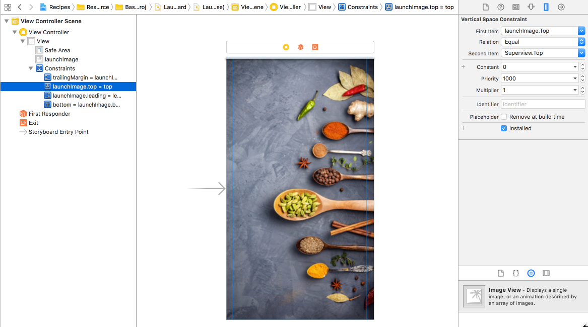

Recipes App
==

## Description

- An app that showcases many recipes together with their detail information
- Support iOS 9+
- Use data from http://food2fork.com/about/api
- Good practices for structuring iOS app and handle dependencies

### Project

- Create new project, select both Unit Tests and UI Tests
- Organising files

  - Source: contains source code files, splitted into features
  - Resource: contains plist, resource, Storyboard files

### Git

- Use `.gitignore` file from https://www.gitignore.io/api/swift
- There are both pros and cons of checking in dependencies files (CocoaPOds and Carthage). Here I choose to ignore them to not clutter the code base.

### Launch Screen

- Prefer using `LaunchScreen.storyboard`
- Add launch image to `Asset Catalog`, open `LaunchScreen.storyboard`, add `UIImageView` and pin it to the egdes of `UIView`
- Should not pin to Safe Area as we want image to be full screen. Also unselect any margins in Auto Layout constraints
- Set `UIImageView` 's `contentMode` as `Aspect Fill`

### App Icon

- Make sure image has no transparent pixels, otherwise it results in black background. Read [
Human Interface Guidelines - App Icon](https://developer.apple.com/ios/human-interface-guidelines/icons-and-images/app-icon/)

> Keep the background simple and avoid transparency. Make sure your icon is opaque, and don’t clutter the background. Give it a simple background so it doesn’t overpower other app icons nearby. You don’t need to fill the entire icon with content.

- Preferrably use image with size greater than 1024x1024
- Use [IconGenerator](https://github.com/onmyway133/IconGenerator) to generate `AppIcon.appiconset`

## Credit

- Launch image is from http://desertrosemediapa.com/
- App icon is from https://www.flaticon.com/free-icon/rice_168559

## Licence

This project is released under the MIT license. See LICENSE.md.
